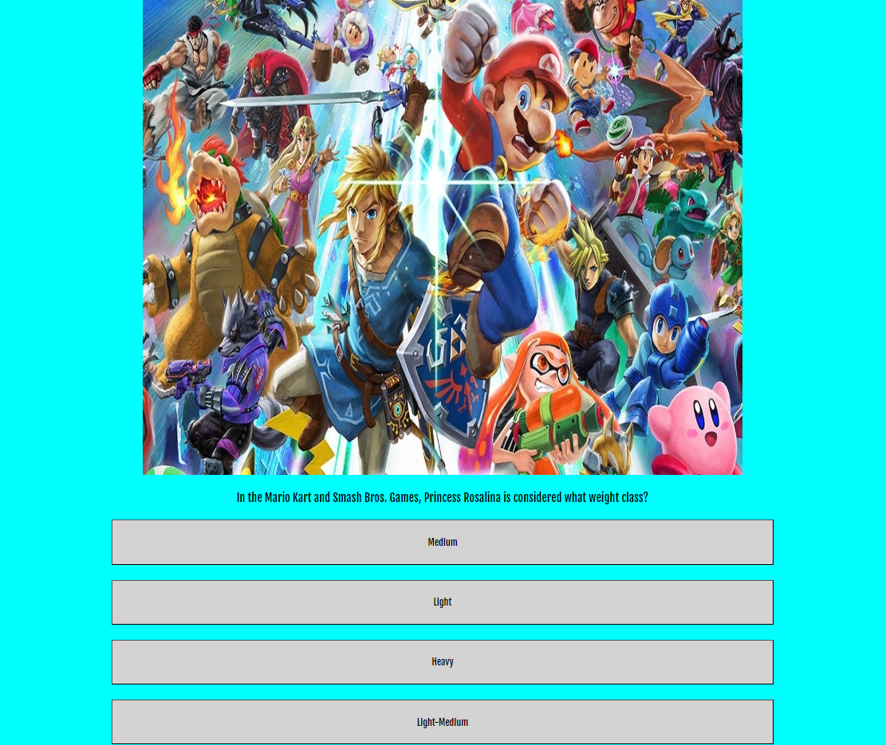
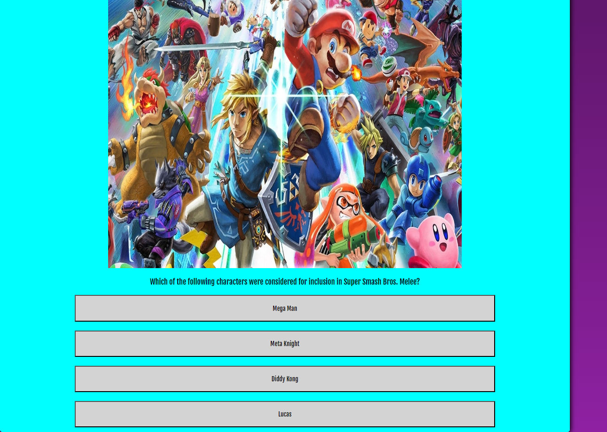

<h1 align="center"> Ultimate VideoGame Quiz (Project2)</h1>

Ultimate VideoGame Quiz is a website that host a fully functional quiz, that will challenge your videogame knowledge. Choose between Easy, Medium or Hard question to find the appropiate difficulty.
This website allow you to answer up to 7 question at a time from a randomized list of question in each difficulty, selecting the right answer out of 4 possible or picking true or false.

## Index - Table of Contents
* [List of features](#features)
* [UX/UI](#ux-ui)
* [Testing](#testing)
* [Deployment](#deployment)
* [Citation of ALL sources](#citations)
* [Future features](#future-features)
* [Known Bugs](#know-bugs)

### FEATURES

- __Main-Menu:__  
- Main menu image is fully responsive to width of screen and contains the difficulty selectors for starting quiz.
- The difficulty selectors are easy to see and fully responsive.
 

- __Quiz help section:__
- During the quiz, there is a responsive and togglable help section above the quiz.
 

- __Quiz exit early clickable element:__
- Clickable text element below Header and above quiz + help text, that sends you back to main menu if you feel that you made a mistake with difficulty.

- __Quiz section:__
- Question related image
- Question displayed below the image and above the answer buttons.
- For multiple answers 4 answer buttons will be displayed below the question, only 2 will show if it is a true or false statement.
 

- __Score section:__
- Score section displays after quiz has reached its 7 questions.
- Your score is displayed with a paragraph below it commenting depending on your results.
- Below this a clickable text element with instruction to return to main menu.
 

### UX-UI
__As a site owner the goal is to:__
- Create an interactive and responsive site with challenging question and tracked score.
- Giving the option to the user to select the difficulty so they can enjoy the quiz at their own suitable pace.
- Giving the option to exit the quiz early if needed and select an easier difficulty.

__As a first time user the goal is to:__
- Easily understand the purpose on the website and what they can expect.
- Give the users a nice first look of the site with eye-catching colors and theme.
- Easy to follow instructions and "on-rail" system for starting game, selecting answers and returning to main menu.

__As a returning user the goal is to:__
- Having a random selection of question for all 3 difficulties and random location of answer button.
- All the sections are easy to access and view the menu quickly and easily.
- Wish for leaderboard to track highscores.

### TESTING

__Validator__

[HTTP-Validator](https://validator.w3.org/nu/)
- Index.html  

- style.css  

- script.js  

- JShint was tested under the assumption that ES6 is allowed. 

- Lighthouse results on desktop devices  

- LightHouse on Mobile devices recieves a lower score on prefomance due to Main menu image only take up half the page.
- In future development, the difficulty selectors will be displayed below the Hero image for easier access and better visuals.

__Manual Testing__
- The website was tested in multiple browsers without any issues. Each clickable element on the page is responding as intended.
- You can easily start over from the main menu if you feel the difficulty is too high and all counters reset on restart.
- Quiz on Deskopts:
 

- Quiz on mobile devices: 
 

__Hero image:__
- The hero image is responsive and scales correctly on all screen sizes and devices.
- The Main menu's clickable elements for selecting difficulty correctly opens the quiz on selected difficulty.

__Quiz section:__
- The quiz section scales to the window and shows a question related image and question with 2 or 4 answer buttons below.
- The answers light up green if the correct answer is selected and you have a second before the next question is presented.
- Above the quiz there is a clickable help text element that provides a help window to appear below it. This window is toggable.
- Above the help text element there is a revert back to main menu and exit quiz.

__Score section:__
- The score section shows your final score and a paragraph depending on how good you were.
- Under the paragraph there is a clickable text element that takes you back to the main menu.

__Bugs__
- During development that I dedicated extra time fixing:
- ReferenceError: Cannot access 'questionsMedium' before initialization 
- Fix = questionElement syntax error document.get was misspelt..

- Answer button background color cant be reset
- Fix = when calling element by Id, the value put was not registrating as string and the color i was trying to set did not exist (light-gray) when it should have been lightgray.

- Select answer gets called twice second time around
- Fix = moved out addlistEvent click reader outside of all functions and only changed innerHTML for each button.

- If you click multiple times on the buttons before the 1 second timeout timer shows the next question, both color of the button changes and score index gets affected.

__Browser Compatibility__

- Webpage is compatibal with Opera, Chrome, Edge and Firefox

### DEPLOYMENT

__The site was deployed to GitHub pages. The steps to deploy are as follows:__
- In the GitHub repository, navigate to the Settings tab and select the pages in the bottom left. 
- From the source section drop-down menu, select the Master Branch.
- Once the master branch has been selected, the page will be automatically refreshed with a detailed ribbon display to indicate the successful deployment.
- Updates or changes to the master branch will take affect on the website

The live link can be found here - [Ultimate Video-Game Quiz!](https://oile995.github.io/Project2/)

### CITATIONS

__Content__
- Content and layout was loosely based on 80s-Mixtape, Geo-master, the Love Maths Project and Web Dev Simplified Build a Quiz with Javascript.

__Code__
- Base template repository take from: [Code Institute Gitpod Full Template](https://github.com/Code-Institute-Org/gitpod-full-template) 
- Code on how to do and style hero image section based on example code on : [Code Institute Love running Hero Image](https://learn.codeinstitute.net/courses/course-v1:CodeInstitute+LR101+2021_T1/courseware/4a07c57382724cfda5834497317f24d5/6fd29d155c3b42248ff57bae32978a4b/)
- Code on how to do and style and contain quiz section based loosely on example code on : [Geo-master by Alan Bushell](https://alan-bushell.github.io/geo-masters/#) and [Web Dev Simplified](https://www.youtube.com/watch?v=riDzcEQbX6k)
- Code on function flow and objectives initally based on : [Geo-master by Alan Bushell](https://alan-bushell.github.io/geo-masters/#) and [Web Dev Simplified](https://www.youtube.com/watch?v=riDzcEQbX6k)
- Code on how to setup eventlistener and send parameter with function call taken from : [MDM Web Docs eventlistener](https://developer.mozilla.org/en-US/docs/Web/API/EventTarget/addEventListener) & [plainEnlish.io](https://plainenglish.io/blog/passing-arguments-to-event-listeners-in-javascript-1a81bc397ecb)
- Code on how to sort question arrays randomly taken from : [Web Dev Simplified](https://www.youtube.com/watch?v=riDzcEQbX6k)
- Code on how hide objects using hide class taken from : [Web Dev Simplified](https://www.youtube.com/watch?v=riDzcEQbX6k)
- Code with question array of objects generated and modified from : [Open trivia API](https://opentdb.com/api_config.php) 
- Code on how to do media queries and known presets based on code from: [Known sizing by gokulkrishh](https://gist.github.com/gokulkrishh/242e68d1ee94ad05f488) 
- Code on how to access and use question arrays loosely taken from : [Geo-master by Alan Bushell](https://alan-bushell.github.io/geo-masters/#)
- Code on how to use timeout function for when answer is select taken from : [80s-mixtape pp2 example](https://siobhanlgorman.github.io/80s-Mixtape-Quiz/quiz.html)
- Code on how to set InnerHTML taken from : [MDM Web Docs InnerHTML](https://developer.mozilla.org/en-US/docs/Web/API/Element/innerHTML)
- Code on how to outline and style text taken from : [CSS-tricks](https://css-tricks.com/adding-stroke-to-web-text/)
- Code on how to input grid layout for answer buttons taken from : [W3C-School css-grid](https://www.w3schools.com/css/css_grid.asp)

__Media:__ 

- Fonts taken from [Google fonts](https://fonts.google.com/specimen/Fjalla+One)
- FavIcon taken from [Favicon.io](https://favicon.io/favicon-converter/)

- All Quiz images source links below: 

- https://i.pinimg.com/originals/dc/a6/b0/dca6b05cba57d1a025b80f07f454611a.png
- https://assets2.ignimgs.com/2016/07/18/final-fantasy-xv-button-2016jpg-19b146.jpg
- https://www.gannett-cdn.com/presto/2019/03/27/PREN/f6a59846-6212-432b-91b4-43aed1ab3e64-The_Legend_of_Heroes_Trails_of_Cold_Steel_Key_Art_Cropped.jpg
- https://m.media-amazon.com/images/I/71x0nZOPKbS.jpg
- https://assets.funnygames.se/1/4881/57940/672x448/space-shooter.webp
- https://static.wikia.nocookie.net/fireemblem/images/2/2a/Fire_emblem_noken.jpg/revision/latest?cb=20060112211948
- https://static.posters.cz/image/750/poster/pokemon-eevee-i32673.jpg
- https://oyster.ignimgs.com/mediawiki/apis.ign.com/rainbow-six/1/17/R6S_Valk1.jpg
- https://assets-prd.ignimgs.com/2022/01/21/need-for-speed-underground-2-button-crop-1642797115202.jpg
- https://assets1.ignimgs.com/2019/09/04/super-mario-world---button-fin-1567640652381.jpg
- https://media-rockstargames-com.akamaized.net/rockstargames-newsite/img/global/games/fob/1280/V.jpg
- https://static-cdn.jtvnw.net/ttv-boxart/65997_IGDB-285x380.jpg
- https://imageio.forbes.com/blogs-images/davidthier/files/2019/09/mario-1200x797.jpg?format=jpg&width=960
- https://www.esportstales.com/team-fortress
- https://marvskun.artstation.com/projects/lV4KqY
- https://scienceline.org/2020/01/tetris/
- https://www.ign.com/articles/2018/12/06/super-smash-bros-ultimate-review
- https://www.npr.org/2023/01/26/1150931836/dead-space-review
- https://insider-gaming.com/resident-evil-4-remake-achievements/
- https://gamingtrend.com/feature/reviews/massive-improvement-tom-clancys-the-division-2-review/
- https://rust.facepunch.com/news/the-big-qol-update
- https://hitmarker.net/news/metal-gear-solid-3-remake-and-new-castlevania-rumored-to-be-revealed-at-e3-1978450
- https://www.gameinformer.com/b/news/archive/2018/04/14/see-how-insomniac-made-spyro-2-run-on-the-original-playstation-in-this-video.aspx
- https://en.wikipedia.org/wiki/Electronic_Arts
- https://www.nintendo.co.uk/Games/Nintendo-DS/Fire-Emblem-Shadow-Dragon-270825.html
- https://www.pcgamer.com/minecraft-now-has-one-unified-launcher-on-pc/
- https://www.callofduty.com/modernwarfare2
- https://www.nintendolife.com/news/2022/08/watch-how-to-get-good-at-collecting-retro-video-games-without-breaking-the-bank
- https://soundcloud.com/solunary/megalovania-sol-ver
- https://www.playstation.com/sv-se/games/the-sims-4/
- https://www.xbox.com/sv-SE/games/store/metal-gear-solid-v-the-definitive-experience/bw050bmb7fd7
- https://www.svampriket.se/2016/03/mr-gimmick/
- https://www.skywardfm.com/post/zero-profit-margins-the-high-praise-and-low-sales-of-ace-combat-zero
- https://www.nintendo.co.uk/Games/Wii/Monster-Hunter-Tri-282090.html
- https://www.gamingbible.com/news/call-of-duty-zombies-coming-back-huge-way-374859-20230113
- https://eu.shop.battle.net/en-us/product/diablo-immortal
- https://techraptor.net/tabletop/guides/magic-gathering-guide
- https://www.xbox.com/en-US/games/fallout-76
- https://store.steampowered.com/app/730/CounterStrike_Global_Offensive/?l=swedish
- https://www.playstation.com/en-us/games/minecraft/

The main menu hero image where made and taken from Canva.com: 
- quiz-home.png

__Quiz questions generated from__  
Generated and modified from OpenTriviaDB
- [Open trivia API](https://opentdb.com/api_config.php) 

### FUTURE-FEATURES
- Fix the bug that allows you to click more than once when selecting answer during the timeout period.
- Pop out difficulty selectors and make a column below the image on main menu for mobile devices
- Add image to the score section relevant to how much score you got.
- Add a live score tracker
- Add a countdown timer and change the scoring system depending on how quickly you answer.
- Add question type that takes input text and compares.
- Add leaderboard to front page tracking highscores.

### KNOWN-BUGS

- If you click muliple times on the answer buttons the scoreIndex and the color of the buttons get effected. Missing stop listener after first click, for future implementation.
- Main menu got a lot of open void on devices where Width is smaller than height. (This was overlooked as I wanted to focus on the Javascript functions of this project)
- Score section  got a lot of open void which could be populated. (This was overlooked as I wanted to focus on the Javascript functions of this project)

